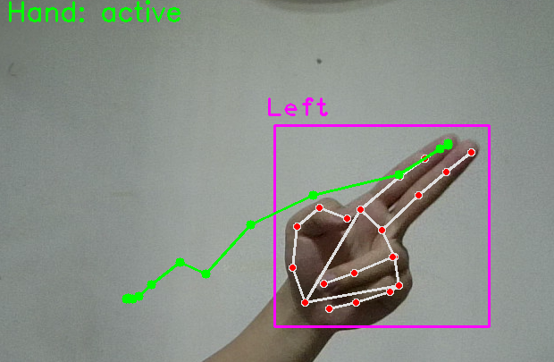

# HandControl – Swipe Gesture Control

Lets you control your computer using hand swipe gestures via your webcam. It detects swipe gestures (left, right, up, down) and simulates arrow key presses using `pyautogui`.

---

## 📦 Installation

1. **Clone the Repository**
```bash
git clone https://github.com/stanX19/HandControl.git
cd HandControl
```

2. **Install Dependencies**

Make sure you are using **Python 3.8+**. Install the required packages:

```bash
py -m pip install -r requirements.txt
```

---

## ▶️ Running the App

Once inside the project folder:

```bash
py main.py
```

1) Your webcam will activate, and a window will open showing the detected hands.
2) You can try to swipe and see if its detected, and familiarise yourself with the camara range.
3) Minimize the window and click (focus) on the content you want to swipe
4) Now you can use swipe gestures to control left right up down

---

## 🕹️ Usage Instructions

- **Swipe Left** → Triggers the **Right Arrow Key**
- **Swipe Right** → Triggers the **Left Arrow Key**
- **Swipe Up** → Triggers the **Down Arrow Key**
- **Swipe Down** → Triggers the **Up Arrow Key**

### Notes:
- Only your **right hand** is tracked.
- Gestures are recognized when you move your hand **actively** (at least 1 finger up).
- Swipes must be **fast** and happen within a **1-second window**.
- There is a **1.5-second cooldown** after each detected swipe to prevent duplicates.
- The app tolerates brief hand disappearance or closure during a swipe motion.

Press **`q`** or close the window to exit.

---

## 📸 Snapshots

Left Swipe Example



---

## 🧠 How It Works

- Uses OpenCV and `cvzone.HandTrackingModule` to track hand landmarks.
- Analyzes motion of the **index fingertip** over time.
- Averages velocity vectors to robustly detect swipe direction.
- Sends virtual keypresses using `pyautogui`.

---

## 📃 License

MIT License. Use freely with attribution.
